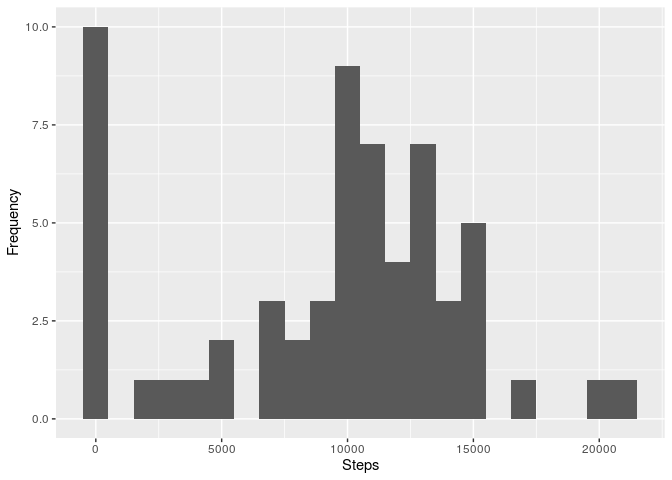
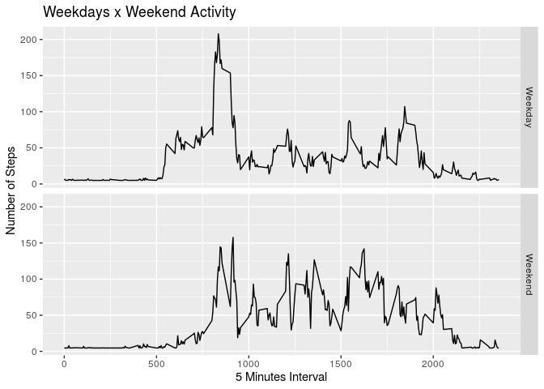

##             1- Loading the Dataset

```r
#   1.1- Load the data ( i.e.read.csv() )
data <- read.csv("activity.csv")

#   1.2- Process/transform the data (if necessary) into a format suitable for your analysis
df <- tbl_df(data)
df <- group_by(df, date)
```


##             2-  What is the mean total number of steps taken per day?

```r
#       2.1- Calculate the total number of steps taken per day
df_sum_per_day = summarise_all( df, sum,na.rm=TRUE )
total_steps_per_day <- df_sum_per_day[2]

#       2.1- Make a histogram of the total number of steps taken each day
qplot( total_steps_per_day$steps, geom="histogram", xlab="steps", ylab="frequency" )
```

```
## `stat_bin()` using `bins = 30`. Pick better value with `binwidth`.
```

<!-- -->

```r
#       2.3- Calculate and report the mean and median of the total number of steps taken per day
mean_steps_per_day <- mean( df_sum_per_day$steps )
median_steps_per_day <- median( df_sum_per_day$steps )
```
  **The mean of total step per day is 9354.2295082 and its median is 10395.**

##             3-  What is the average daily activity pattern?

```r
#       3.1 Make a time series plot
df_sum_per_interval = group_by(df, interval)
df_mean <- summarise_all( df_sum_per_interval, mean, na.rm=TRUE )
plot( df_mean$interval, df_mean$steps, type="l", xlab="5 Minutes Interval", ylab = "Mean Steps" )
title(main="Average Number of Steps Taken")
```

<!-- -->

```r
#       3.2 Which 5-minute interval, on average across all the days in the dataset, contains the maximum number of steps?
max_steps <- df_mean$interval[ which.max(df_mean$steps) ]
```
**There was a maximum of 835 steps taken.**

##             4-  Imputing missing values

```r
#       4.1 Calculate and report the total number of missing values in the dataset (i.e. the total number of rows with NAs)
total_nas = sum( is.na(df$steps) )
```
**This dataset has a total of 2304 rows with NA values**

```r
#       4.2 Devise a strategy to fill NA values
fill_with_mean <- function( df_by_date ){
    
    dates <- unique( df_by_date$date )
    for( curr_date in dates ){
        indexes <- which( df_by_date$date == curr_date )
        # Get the mean of current date
        date_mean = mean( df_by_date$steps[ indexes ], na.rm=TRUE )
        
        if( is.na( date_mean ) )
            date_mean = 0
        
        # Get NA's indexes
        nas_indexes = which( is.na( df_by_date$steps[ indexes ] ) )
        df_by_date$steps[indexes][ nas_indexes ] = date_mean
    }
    df_by_date
}
#       4.3- Create a new dataset that is equal to the original dataset but with the missing data filled in.
df_filled <- fill_with_mean(df)
#       4.4.1- Make a histogram of the total number of steps taken each day
filled_sum_per_day = summarise_all( df_filled, sum,na.rm=TRUE )
qplot( filled_sum_per_day$steps, geom="histogram", xlab="Steps", ylab="Frequency", main="Average Number of Steps After Filling NAs" )
```

```
## `stat_bin()` using `bins = 30`. Pick better value with `binwidth`.
```

<!-- -->

```r
#       4.4.2- Calculate and report the mean and median total number of steps taken per day.
filled_steps_mean <- mean( filled_sum_per_day$steps )
filled_steps_median <- median( filled_sum_per_day$steps )
```
#### 4.4.3- Does filling with NA change the final values? What was the impact of fill the dataset NA values?
  **Filling the NA entries of this dataset with the day mean had no impact in the final results.**

##             5-  Are there differences in activity patterns between weekdays and weekends?

```r
#       5.1- Create a new factor variable in the dataset with two levels – “weekday” and “weekend”
wdays <- wday( ymd( df_filled$date ) )
wdays[ wdays == 1 | wdays == 7 ] = "Weekend"
wdays[ wdays != "Weekend" ] = "Weekday"
df_filled <- ungroup(df_filled)
df_filled <- mutate( df_filled, wdays = factor(wdays) )

#       5.2- Make  plot 5 minuts interval x ( mean of steps at weekdays and another by weekend )
df_by_daytype = group_by( df_filled, wdays, interval )
mean_steps = summarise(df_by_daytype, mean=mean(steps))

g <- ggplot( mean_steps, aes( interval, mean ) )
g + geom_line() + facet_grid( wdays ~ . ) + labs(title="Weekdays x Weekend Activity") + labs( x="5 Minutes Interval" , y="Number of Steps")
```

<!-- -->
